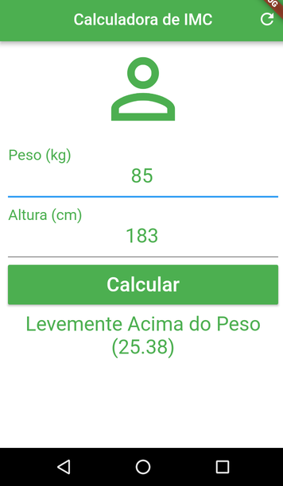

<h1 align="center">
    calculadora-IMC
</h1>

## 💻 Sobre o projeto

Projeto que consiste em um aplicativo mobile que executa cálculos de IMC.

---

## ⚙️ Funcionalidades

- Realiza cálculo do IMC;
- Interface simples;
- Fácil de utilizar.

---

## 📷 Imagens do projeto

  

  

---

## 🚀 Como executar o projeto

Instalar o APK e executar em um aparelho Android ou iOS.

---

## 🛠 Tecnologias utilizadas

Foram utilizadas as seguintes ferramentas: Flutter, Kotlin, Dart.

---

## 👨‍💻 Autor
 
 <b>Lucas William Martins Lima</b>
  
 
---
